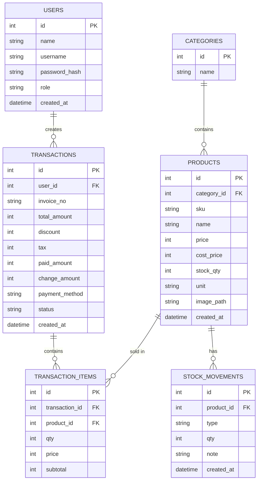

# Detail Pembuatan Aplikasi POS (Point of Sale) - Kasirin

Target: Aplikasi POS Android Kasirin, database lokal, rilis ke Google Play Store.

**Asumsi stack:** Flutter + SQLite (package `sqflite` atau `drift`). Kalau nanti mau ganti ke Kotlin native, struktur database & fitur di bawah tetap berlaku, hanya implementasi kode yang beda.

---

## 1. Cakupan Fitur

### MVP (wajib ada di rilis pertama)
- Login kasir/admin
- Manajemen produk & kategori (tambah, edit, hapus, upload foto)
- Modul kasir: pilih produk, hitung total, diskon, bayar, cetak/tampilkan struk
- Manajemen stok (otomatis berkurang saat transaksi, bisa restock manual)
- Riwayat transaksi & laporan penjualan harian

#### Mockup UI Kasirin (rancangan awal)
Berikut gambaran antarmuka MVP yang disarankan untuk aplikasi Kasirin:

- Halaman Login
  - Logo Kasirin di bagian atas
  - Field username dan password
  - Tombol Masuk
  - Opsi ingat saya / lupa password (opsional)

  Contoh visual mockup:

  ```text
  ┌─────────────────────────────────────┐
  │           ╔══════════════╗         │
  │           ║   KASIRIN     ║         │
  │           ║  Point of Sale║         │
  │           ╚══════════════╝         │
  │                                     │
  │  Username  ───────────────────────  │
  │  admin                              │
  │                                     │
  │  Password  ───────────────────────  │
  │  ***********                        │
  │                                     │
  │      ┌───────────────┐             │
  │      │    Masuk       │             │
  │      └───────────────┘             │
  │                                     │
  │  □ Ingat saya      Lupa password?   │
  └─────────────────────────────────────┘
  ```

  Kalau mau, saya juga bisa lanjutkan membuat mockup gambar untuk halaman dashboard, produk, dan struk agar terlihat seperti desain aplikasi yang lebih lengkap.

- Halaman Dashboard Kasir
  - Bagian pencarian produk
  - Kartu produk dengan nama, harga, stok
  - Ringkasan belanja di sisi kanan
  - Tombol diskon, bayar, batalkan transaksi

  Contoh visual mockup:

  ```text
  ┌──────────────────────────────────────────┐
  │ KASIRIN                [Produk] [Laporan] │
  │ Search: kopi, mie, snack                 │
  │                                          │
  │ [Kopi Latte]  Rp 18.000  Stok 10        │
  │ [Mie Goreng]  Rp 12.000  Stok 8         │
  │ [Snack]       Rp  8.000  Stok 15        │
  │                                          │
  │                Cart                      │
  │  1x Kopi Latte      Rp 18.000           │
  │  1x Mie Goreng     Rp 12.000           │
  │  Total             Rp 30.000           │
  │  Discount          Rp  0               │
  │  Bayar             Rp 50.000           │
  │  Kembalian         Rp 20.000           │
  │                                          │
  │   [Diskon]   [Bayar]   [Batal]         │
  └──────────────────────────────────────────┘
  ```

- Halaman Manajemen Produk
  - Daftar produk dengan foto, nama, harga, stok
  - Tombol tambah, edit, hapus produk
  - Filter berdasarkan kategori

  Contoh visual mockup:

  ```text
  ┌──────────────────────────────────────────┐
  │ Manajemen Produk                        │
  │ + Tambah Produk                         │
  │                                          │
  │ [Foto] Kopi Latte      Rp 18.000  10   │
  │ [Foto] Mie Goreng      Rp 12.000   8   │
  │ [Foto] Snack           Rp  8.000  15   │
  │                                          │
  │ Filter: [Semua] [Minuman] [Makanan]    │
  │                                          │
  │ [Edit] [Hapus]   [Edit] [Hapus]       │
  └──────────────────────────────────────────┘
  ```

- Halaman Transaksi & Struk
  - Daftar item yang dibeli
  - Total belanja, diskon, uang bayar, kembalian
  - Tombol cetak / tampilkan struk

  Contoh visual mockup:

  ```text
  ┌──────────────────────────────────────────┐
  │            STRUK PEMBELIAN             │
  │ Kasirin POS                            │
  │ 22/07/2026 14:30                       │
  │----------------------------------------│
  │ Kopi Latte        1 x 18.000 18.000    │
  │ Mie Goreng       1 x 12.000 12.000    │
  │----------------------------------------│
  │ Total            Rp 30.000            │
  │ Bayar            Rp 50.000            │
  │ Kembalian        Rp 20.000            │
  │----------------------------------------│
  │        [Cetak Struk] [Selesai]        │
  └──────────────────────────────────────────┘
  ```

- Halaman Laporan Harian
  - Total penjualan hari ini
  - Jumlah transaksi
  - Daftar transaksi terbaru

  Contoh visual mockup:

  ```text
  ┌──────────────────────────────────────────┐
  │ Laporan Penjualan Hari Ini             │
  │ Total Penjualan: Rp 1.250.000         │
  │ Jumlah Transaksi: 24                  │
  │                                          │
  │ 14:30 - Kopi Latte     Rp 18.000      │
  │ 14:45 - Mie Goreng     Rp 12.000      │
  │ 15:10 - Snack          Rp  8.000      │
  │                                          │
  │ [Export PDF] [Filter Hari]            │
  └──────────────────────────────────────────┘
  ```

### Lanjutan (setelah MVP jalan)
- Multi-user dengan role (admin, kasir)
- Cetak struk via printer bluetooth
- Laporan per periode (mingguan, bulanan) + export
- Backup/restore database lokal
- Multi-outlet / sinkronisasi cloud (kalau nanti butuh online)

---

## 2. Skema Database



Catatan:
- `stock_movements.type` bisa berisi nilai seperti `in`, `out`, `adjustment`.
- `transactions.status` untuk menandai transaksi `paid`, `void`, atau `refund`.

---

## 3. Struktur Project (Flutter)

```
lib/
  main.dart
  core/
    constants.dart
    theme.dart
    utils/
  data/
    db/
      database_helper.dart
      migrations/
    models/
      product.dart
      transaction.dart
      user.dart
    repositories/
      product_repository.dart
      transaction_repository.dart
      stock_repository.dart
  features/
    auth/
    products/
    pos/            # layar kasir (inti aplikasi)
    stock/
    reports/
    settings/
  widgets/           # komponen UI yang dipakai bersama
```

---

## 4. Tahapan Pengembangan

| Fase | Aktivitas | Estimasi |
|---|---|---|
| 0 | Setup project, pilih stack final, wireframe UI, buat akun Play Console | 3-5 hari |
| 1 | Setup database lokal + auth login | 1 minggu |
| 2 | Manajemen produk & kategori | 1 minggu |
| 3 | Modul kasir/transaksi (fitur inti) | 1.5-2 minggu |
| 4 | Manajemen stok | 3-5 hari |
| 5 | Laporan penjualan | 3-5 hari |
| 6 | Polish UI, cetak struk (opsional printer bluetooth) | 1 minggu |
| 7 | Testing internal & perbaikan bug | 1 minggu |
| 8 | Closed testing & publish ke Play Store | 2-3 minggu (termasuk masa tunggu Google) |

---

## 5. Syarat Publish ke Google Play Store

- [ ] Akun Google Play Console (bayar sekali, sekitar $25)
- [ ] Privacy Policy (URL publik) — tetap wajib meski app offline, karena app minta izin storage/kamera
- [ ] Data Safety Form — deklarasi data apa saja yang diakses/disimpan app
- [ ] App icon 512x512 px
- [ ] Feature graphic 1024x500 px
- [ ] Screenshot minimal 2 (disarankan 4-8)
- [ ] Deskripsi singkat & lengkap aplikasi
- [ ] App signing (Play App Signing, direkomendasikan Google)
- [ ] Target API level sesuai kebijakan terbaru Google Play
- [ ] Closed testing: minimal 12 tester aktif selama 14 hari berturut-turut (wajib untuk akun developer baru sebelum bisa rilis ke production)
- [ ] Kategori aplikasi: Business / Productivity

---

## 6. Hal yang Perlu Diputuskan Sebelum Mulai Coding

1. Final tech stack (Flutter vs Kotlin native)
2. Apakah butuh multi-user/role dari awal atau cukup single user dulu
3. Apakah butuh cetak struk fisik (printer bluetooth) di MVP atau nanti
4. Model bisnis: dijual ke banyak toko (butuh lisensi/aktivasi) atau untuk 1 toko sendiri
